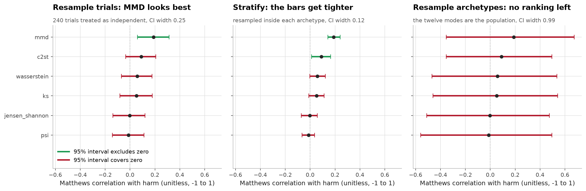
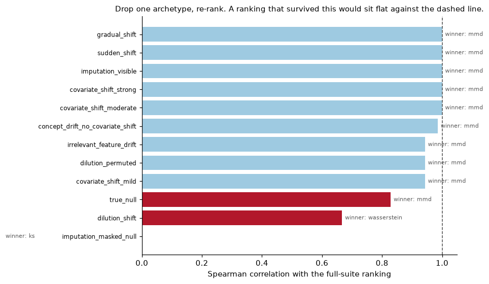
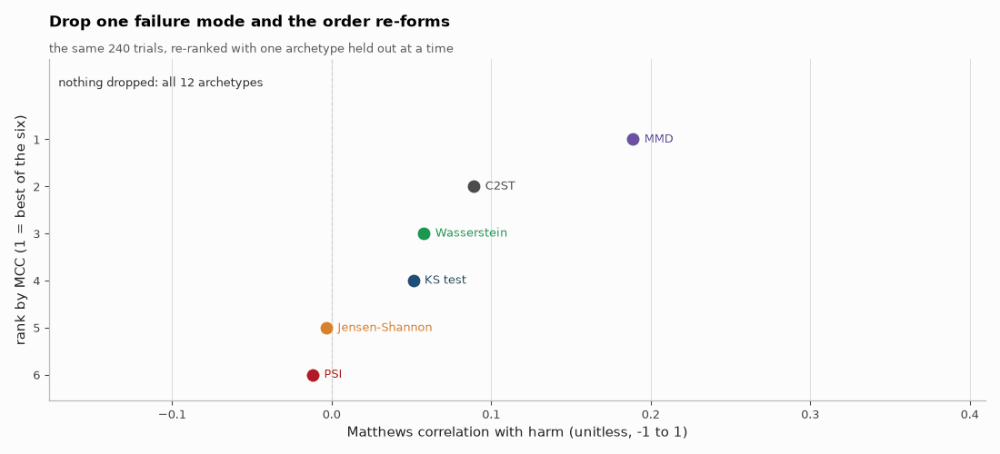
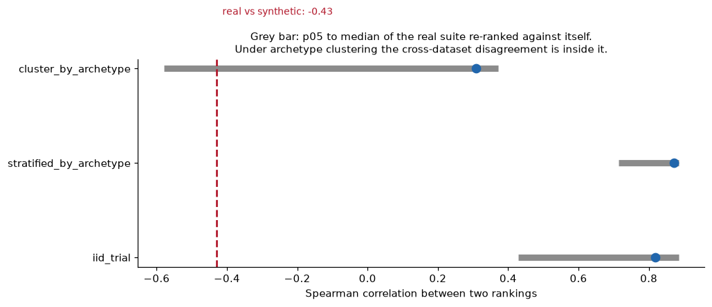
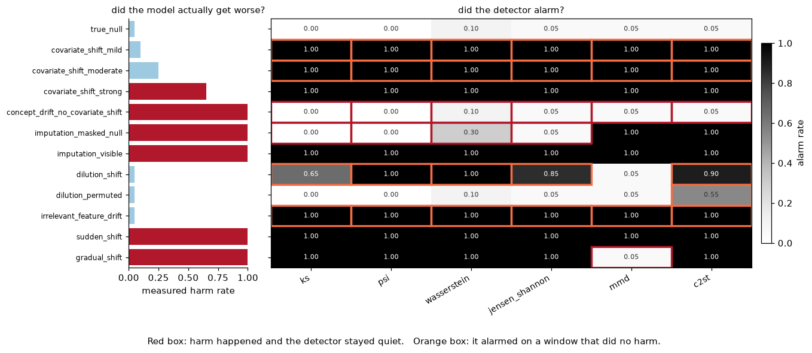
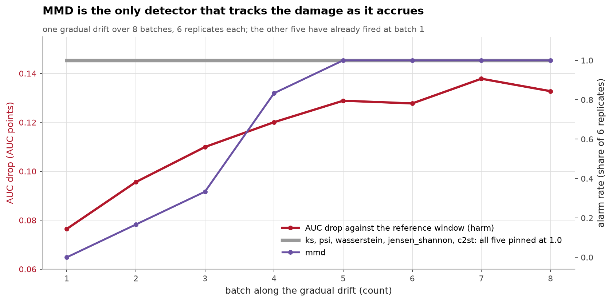
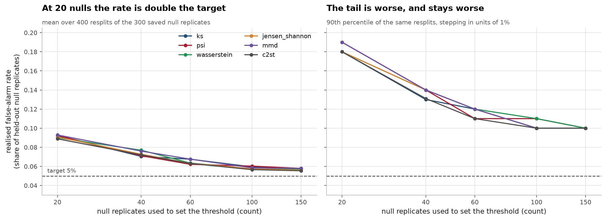

# DriftHarm

**Do drift detectors tell you the model got worse?**
A benchmark where the harm label is measured rather than assumed, and the answer
is that the resulting detector ranking is not stable enough to report.

[](tests/)
[](LICENSE)

Twelve failure archetypes are applied to windows drawn from a held-out pool, a
model that has seen neither window scores both, and the drop in its AUC, measured
against a null of window pairs where nothing was applied, is the harm label. Six
detectors are calibrated against that same null at a common 5% false-alarm
target, so no detector runs a tighter threshold than any other, and alarms are
cross-tabulated against harm and scored by Matthews correlation. Everything
quoted here comes from a file in [`reports/`](reports/); the long version of
every section below is in [notes/METHODS.md](notes/METHODS.md).

## The headline result

Under trial-level resampling MMD appears to win (MCC 0.189, 95% CI
[0.061, 0.315]). Under archetype-level resampling, the honest choice when twelve
failure modes are the population of interest, the mean interval width grows from
0.25 to 0.99, every interval covers zero, and the ordering carries no
information.



240 trials (12 archetypes × 20 replicates), 20,000-row windows, harm base rate
51.7%. MCC, precision and recall are all with respect to *harm*, not with
respect to whether the distribution moved.

| detector | MCC | 95% CI, trials resampled | 95% CI, **archetypes resampled** | P(MCC > 0) | P(best of six) | harm-precision | harm-recall | specificity |
| --- | --- | --- | --- | --- | --- | --- | --- | --- |
| MMD | 0.189 | [0.061, 0.315] | [−0.353, 0.674] | 0.76 | 0.57 | 0.593 | 0.694 | 0.491 |
| C2ST | 0.089 | [−0.035, 0.207] | [−0.353, 0.495] | 0.66 | 0.18 | 0.539 | 0.831 | 0.241 |
| Wasserstein | 0.058 | [−0.069, 0.176] | [−0.468, 0.535] | 0.59 | 0.15 | 0.535 | 0.742 | 0.310 |
| KS | 0.051 | [−0.081, 0.179] | [−0.460, 0.542] | 0.59 | 0.11 | 0.536 | 0.661 | 0.388 |
| Jensen-Shannon | −0.003 | [−0.137, 0.121] | [−0.511, 0.476] | 0.51 | 0.00 | 0.516 | 0.669 | 0.328 |
| PSI | −0.012 | [−0.141, 0.112] | [−0.559, 0.496] | 0.50 | 0.00 | 0.512 | 0.661 | 0.328 |

Source: [`reports/real_ranking.csv`](reports/real_ranking.csv),
[`reports/real_rank_stability.csv`](reports/real_rank_stability.csv). Both
intervals are 2,000-draw percentile bootstraps.

**Read the fourth column, not the second.** The narrow interval resamples the
240 trials as if they were 240 independent facts, and they are not: in 53 of the
72 (detector × archetype) cells the alarm rate is exactly 0.00 or 1.00.
Harm-precision runs 0.512 to 0.593 against a base rate of 0.517, so being told a
detector fired moves my belief that the model is damaged by between −0.5 and
+7.6 percentage points. That is the result. Full argument in
[notes/METHODS.md](notes/METHODS.md#21-the-detector-ranking-is-not-stable).



The bootstrap is not the only thing saying so. Dropping a single archetype and
re-ranking moves the order as far as the resampling does and changes the winner
outright in several cases: removing `imputation_masked_null` gives Spearman
−0.46 against the full-suite order and makes KS the winner.



*Each frame drops one of the twelve archetypes and re-ranks the same 240
trials, so the dots move only because of which archetype is held out, while
the detectors, the thresholds and the harm labels stay exactly the same.*

## Real and synthetic disagree no more than one dataset disagrees with itself

The same code on a 60-dimensional correlated-Gaussian control gives a different
order, MMD 1st → 5th, PSI 6th → 3rd, Spearman −0.43. That looks like a
cross-dataset effect and is not one: under archetype clustering, a dataset
resampled against *itself* produces a ranking correlation at or below −0.43
about one time in seven (0.146 on real, 0.148 on synthetic).



Two mechanical differences do sit underneath it and both come from the same two
archetypes. The sharper one: a drop-NaN detector's blindness to a feed outage is
not a property of the detector, it is a property of how much missingness the
reference table already had. The masked-null footprint is the same size on both
datasets, yet KS alarms 0/20 on real and 20/20 on synthetic, because 19 of the
60 monitored real columns are above 80% NaN and set the null floor themselves.
Derivation, footprint and null-floor tables in
[notes/METHODS.md](notes/METHODS.md#222-what-is-genuinely-different-and-it-is-those-same-two-archetypes).

## Where the errors come from



Harm and alarms line up on the easy archetypes and come apart everywhere
interesting. `concept_drift_no_covariate_shift` does harm every time, mean AUC
drop 0.337, and not one of the six notices, because by construction the
covariates do not move. `irrelevant_feature_drift` does no harm and all six fire
on 20/20 replicates, which is the single largest source of false alarms in the
benchmark and entirely avoidable by not monitoring columns the model does not
use. `imputation_masked_null` harms every time and only MMD and C2ST see it;
pointing the monitor at the post-imputation table takes KS and PSI from 0/20 to
20/20, so changing which table the monitor reads bought more recall than
changing the detector did. Covariate shift I had labelled harmless, and its
three strengths measured harm rates of 0.10, 0.25 and 0.65. The per-archetype
table is in
[notes/METHODS.md](notes/METHODS.md#23-where-the-errors-actually-come-from).



Under a gradual drift five of the six detectors are already saturated at batch 1,
before most of the harm has accrued, so their alarm carries no timing
information. MMD is the exception and the one that climbs with the damage, but
it also has the worst delay: 0/6 alarms at batch 1, 6/6 only at batch 5, and it
misses 19/20 gradual trials in the headline run.

## Instrument findings

Four things I found wrong with the measuring apparatus, kept here rather than
fixed in silence. Each is worked through in
[notes/METHODS.md](notes/METHODS.md#3-instrument-findings).

- **The harm label is blind to segment damage, and the ranking depends on it.**
  Both dilution archetypes confine their damage to the top 3% of rows by
  predicted risk, so the aggregate rule scores them harmless. Re-scoring with
  `harm = aggregate OR segment` sends MMD from first to last, 0.189 to −0.216,
  and C2ST from second to first.
- **Threshold calibration needs more null replicates than I first used.** At 20
  null replicates every detector overshoots the 5% target by roughly double. The
  benchmark now uses 300, split 150 for calibration and 150 held out.
- **The synthetic bundle's "irrelevant" features are not causally irrelevant.**
  The fitted LightGBM puts 3.6% of its split gain on the zero-weight columns, so
  the measured harm rate for that archetype on synthetic is 0.35, not the ~0.05
  the design intended. The real bundle does not have this problem.
- **MCC over F1.** C2ST has the best harm-F1 on real data, 0.654, and buys its
  0.831 recall with 88 false positives and a specificity of 0.241. MCC responds
  to the whole table, which is why it is the scoring column.

Realised false-alarm rate against calibration sample size:



## Limitations

One real dataset (IEEE-CIS, tabular fraud, 3.7% positive rate) and one synthetic
generator; nothing here has been checked on text, images or time series. The
twelve archetypes are my taxonomy rather than an exhaustive one, and that is
where essentially all of the uncertainty lives: more replicates cannot fix it,
more archetypes might. Detector hyperparameters are fixed and not swept,
aggregation over columns is always `max`, window size is fixed at 20,000 rows,
and harm is a binary AUC drop rather than calibration, precision at an operating
threshold, or money. Full list in
[notes/METHODS.md](notes/METHODS.md#4-limitations).

## 5. Related work

I need to be precise about what is new here, because the headline observation is
not.

**[aghasalim/mlops-fraud-pipeline](https://github.com/aghasalim/mlops-fraud-pipeline)**
is mine and already showed that drift alerts do not track performance loss. It
monitored KS, PSI and missing-rate over eight windows of IEEE-CIS traffic and
found prediction PSI correlating −0.709 with AUC loss, prediction stability
looking best exactly where the model was worst, and noted, with n = 8, that this
was suggestive rather than conclusive. It also identified the dropped-NaN blind
spot and the invisibility of label shift to input monitors.

So **"drift ≠ harm" is the premise of this repo, not its finding.** The five
things DriftHarm adds on top of it are listed in
[notes/METHODS.md](notes/METHODS.md#5-related-work).

**Prior art I checked and confirmed:**

- NannyML's public writing makes the same core argument, that drift methods
  produce false alarms because not all drift affects performance, and that
  performance estimation should replace drift as the primary signal. Their
  ["Don't let yourself be fooled by data drift"](https://www.nannyml.com/blog/when-data-drift-does-not-affect-performance-machine-learning-models)
  post demonstrates it on a single dataset (Tetouan City power consumption)
  comparing univariate drift against their DLE performance estimator. It is a
  demonstration rather than a benchmark: it does not rank detectors and does not
  report false-alarm or precision/recall statistics for drift alerts. The
  argument is theirs; the measurement here is not the same measurement.
- **Singh, "When Drift Detectors cry Wolf: False Alarm Rates in continuous ML
  Monitoring"**, [arXiv:2607.17336](https://arxiv.org/abs/2607.17336) (19 Jul
  2026, ICLR 2026 CAO workshop). Measures false positives across PSI, KS, MMD,
  LSDD and adversarial validation under continuous monitoring, and finds PSI
  strongly batch-size sensitive above/below roughly 200 samples. Closest
  published work to finding 2 above, and it measures false alarms *without* harm
  labels, which is precisely the gap this repo tries to fill from the other side.
- **Giobergia, Pastor, de Alfaro & Baralis, "A Synthetic Benchmark to Explore
  Limitations of Localized Drift Detections"**,
  [arXiv:2408.14687](https://arxiv.org/abs/2408.14687) (26 Aug 2024). Induces
  drift in a randomly chosen subgroup and shows commonly adopted detectors fail
  when drift is confined to a small subpopulation. This is direct prior art for
  the two dilution archetypes; my contribution there is only that I also measure
  the segment-level *harm*, which is what exposed instrument finding 1.
- **Cerqueira, Gomes, Heyden, Pfahringer & Bifet, "A Framework for Evaluating and
  Benchmarking Concept Drift Detection Methods"**,
  [arXiv:2606.07789](https://arxiv.org/abs/2606.07789) (5 Jun 2026). Benchmarks
  14 concept-drift detection methods over 7 real datasets with timing-aware
  metrics and Monte-Carlo drift injection. Larger and more rigorous than this
  repo on the detection-quality axis; it scores detection, not downstream harm.

If you want the reliable version of the argument, read those.

## Reproducing

```bash
make setup                # venv + editable install
make test                 # 45 tests, ~7s, no dataset needed
make bench-synthetic      # synthetic run end to end (~24 min on an M-series laptop)
make analysis             # regenerate every table above from reports/*.csv (free)
```

The real run needs the IEEE-CIS `train_transaction.csv` and `train_identity.csv`
from the [Kaggle competition](https://www.kaggle.com/c/ieee-fraud-detection/data)
in `~/ieee-fraud-ml/data/raw/`, then `make bench-real`. It trains a fresh
LightGBM on the earliest 40% of the stream by `TransactionDT` and holds out the
rest; held-out AUC is 0.891 on all 431 features and 0.857 through the 60
monitored columns the benchmark drives. CI runs the tests on the synthetic
bundle only, so it never needs the 700 MB download. Details in
[notes/METHODS.md](notes/METHODS.md#6-reproducibility).

## Repository layout

```
src/driftharm/     six detectors, the twelve archetypes, harm labels, null
                   calibration, the suite runner, metrics, and both bundles
experiments/       01 prepare, 02 benchmark, 03 tables, 04 calibration sweep,
                   05 harm-label sensitivity, 06 rank stability, 07 figures
reports/           every CSV/JSON quoted above, tracked on purpose
reports/figures/   the figures, redrawn from those CSVs by `make figures`
tests/             45 tests on the generators and metrics
notes/METHODS.md   the full write-up this page summarises
```

File-by-file notes and what the tests actually assert are in
[notes/METHODS.md](notes/METHODS.md#7-repository-layout).

MIT licensed.

## References

The papers and sources this implementation follows. Each one is here because
the code uses the method, the dataset or the metric it describes.

- **Rabanser, Günnemann, Lipton. Failing Loudly: An Empirical Study of Methods for Detecting Dataset Shift. NeurIPS 2019.** [arXiv:1810.11953](https://arxiv.org/abs/1810.11953) the detector comparison protocol this follows.
- **Gretton, Borgwardt, Rasch, Schölkopf, Smola. A Kernel Two-Sample Test. JMLR 13, 2012.** the MMD detector.
- **Ke, Meng, Finley et al. LightGBM: A Highly Efficient Gradient Boosting Decision Tree. NeurIPS 2017.** the model whose degradation is measured.
